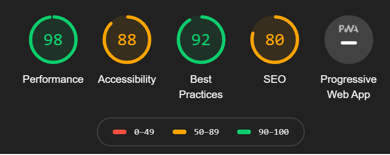

# Webpplikasjoner-oppgave3-utviklingsverktoy
 Oppgaver tilhørende oppgave3 i webapplikasjoner

## Oppgave 4 - Chrome Dev tools

### 1. Antall bilder på forsiden: 4 bilder
### 2. Lastetid med og uten cache (Etter 3 refreshes av siden):
### Med cache:
#### DOMContentLoaded: 389ms
#### Load: 444ms
### Uten cache:
#### DOMContentLoaded: 543ms
#### Load: 717ms
### 3. Audit (Desktop): 
#### 
### 4. Antall eksterne requests: 4 XHR and Fetch (108 requests in total)
### 5. Hva er "Content-Type" i response header: text/html;charset=utf-8
### 6. Hva er "Cache-Control" i request header: max-age=0
### 7. Hvilken protokoll bruker den siden?: HTTPS (HTTP/2 for requests)