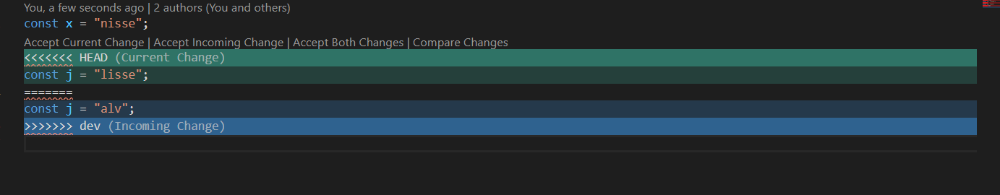

# Webpplikasjoner-oppgave3-utviklingsverktoy

Oppgaver tilhørende oppgave3 i webapplikasjoner

## Oppgave 3 - Git

### Sette opp git lokalt -> git init

### Sette opp nytt repo i Github -> git remote add origin https://github.com/mienna91/test.git

### Lage dev branch lokalt -> git checkout -b dev

### Lage fil i dev branch lokalt (hiof.js fil med console.log("hiof")) touch hiof.js -> git add hiof.js

### Commite disse -> git commit -m "Create hiof.js file"

### Pushe endringene til repo -> git push origin dev

### Lage en fil i dev branch remote -> lagde en ny js fil på github

### Hente endringene lokalt -> git pull https://github.com/mienna91/test dev

### Merge filene fra dev i master -> git checkout master -> git merge dev

### Samarbeide med en kollega eller en annen konto du har for å få til merge conflict

### Resolve merge conflict -> Aksepterte begge forandringer, fullførte merge, commita og pusha
